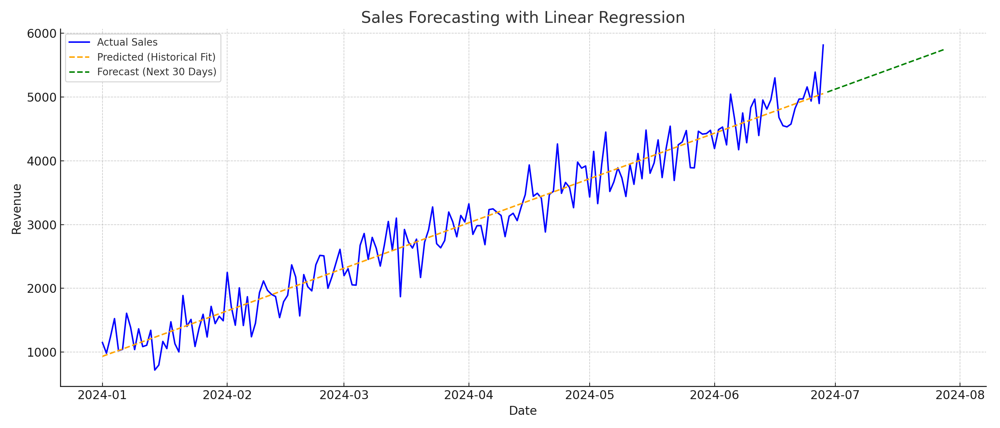

# Sales Forecasting with Linear Regression

This project demonstrates how to use linear regression to forecast future sales revenue based on historical data.

## 📈 Forecast Graph



## 🧪 Model Evaluation

- **R² Score**: 0.9474
- **RMSE**: 282.02
- **MAE**: 222.41

## 📁 Files Included

- `sales_data.csv`: Sample sales data used for training.
- `forecast_table.csv`: 30-day predicted sales.
- `forecast_output.png`: Graph showing actual, predicted, and forecasted sales.
- `forecast_model.py`: Python script for the full pipeline.

## ▶️ How to Run

```bash
pip install pandas numpy matplotlib scikit-learn
python forecast_model.py
```
